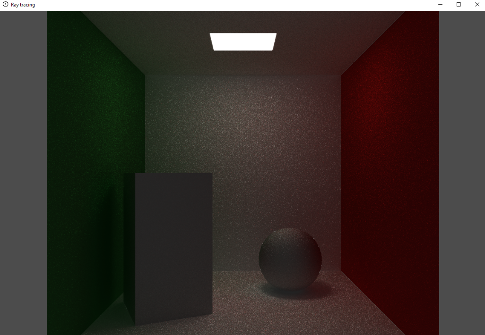

# Vulkan ray tracing engine



Implementation of real-time ray tracing engine based on Vulkan API with KHR ray tracing support

The real-time ray tracer can load full geometry from OBJ files. 
An accumulation image is used to increase the sample count only when the camera is not moving.
There are no image filtering implemented (planned).

## Compilation 

```
mkdir build
cd build
cmake ..
make
```

## Controls 

- **WASD + mouse** - 3D movement
- **C** - Stop mouse trackimng
- **Escape** - Close window

## References
* [Vulkan Tutorial](https://vulkan-tutorial.com/)
* [SaschaWillems projects](https://github.com/SaschaWillems/Vulkan)
* [GPSnoopys project](https://github.com/GPSnoopy/RayTracingInVulkan)
* [Iorange tutorial](https://iorange.github.io/)
